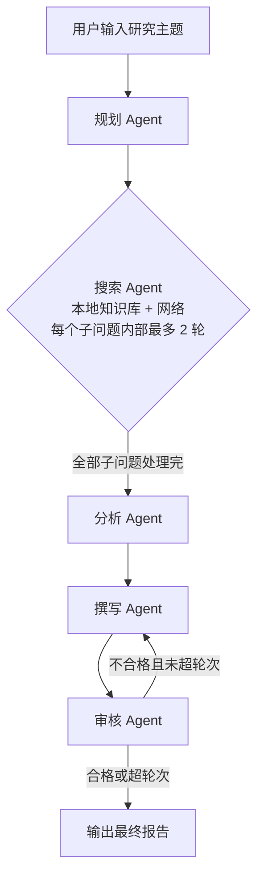

# AgentForge — 基于 LangGraph 的多 Agent 智能研究协作系统

> 用户输入一个研究主题，系统自动完成：任务分解 → 信息检索 → 交叉分析 → 报告撰写 → 质量审核，
> 最终输出一份结构化研究报告。

## 功能特性

- **5 个专业 Agent**：规划 / 搜索 / 分析 / 撰写 / 审核，通过 LangGraph 状态图编排协同工作；
- **受控 ReAct 搜索循环**：规划检索策略 → 执行本地知识库 + 网络搜索 → 评估充分性 → 必要时重写查询词（上限 2 轮）；
- **审核迭代闭环**：结构化评分（1-10）+ 定向修改建议，最大迭代次数可配置，杜绝死循环；
- **FastAPI 后端**：任务提交 / 状态查询 / 报告获取 / 任务历史；
- **Streamlit 前端**：发起研究、实时查看执行日志、展示报告；
- **SQLite 持久化**：任务、分析结果、审核历史全部落库；
- **Docker Compose 一键部署**。

## 系统架构



## 技术栈

Python · FastAPI · LangGraph · LangChain · DeepSeek API · Tavily / DuckDuckGo · ChromaDB · SQLite · Streamlit · Docker

## 快速开始

### 1. 环境准备

```bash
python -m venv venv
# Windows
venv\Scripts\Activate.ps1
# Linux / macOS
source venv/bin/activate

pip install -r requirements.txt
```

### 2. 配置

复制 `.env.example` 为 `.env` 并填写：

```bash
cp .env.example .env
```

必填：

- `DEEPSEEK_API_KEY`：DeepSeek 平台 API Key
- `TAVILY_API_KEY`（可选）：网络搜索 Key；不填则自动回退 DuckDuckGo

### 3. 启动后端

```bash
uvicorn app.main:app --reload --port 8000
```

访问 http://localhost:8000/docs 查看 Swagger API 文档。

### 4. 启动前端

```bash
streamlit run frontend/app.py
```

访问 http://localhost:8501。

### 5. 命令行端到端运行

```bash
python scripts/run_e2e.py "2025年大模型行业趋势分析"
```

运行结果（含真实耗时、审核轮次、报告全文）保存到 `data/run_result.json`。

## API 概览

| 方法 | 路径 | 说明 |
|------|------|------|
| POST | `/api/tasks` | 提交研究任务（异步执行） |
| GET | `/api/tasks` | 任务列表 |
| GET | `/api/tasks/{id}` | 任务详情（含分析结果与报告） |
| GET | `/api/tasks/{id}/report` | 获取最终报告 |
| DELETE | `/api/tasks/{id}` | 删除任务 |
| GET | `/api/reports/{id}/download` | 下载报告 Markdown |
| GET | `/health` | 健康检查 |

## 运行测试

```bash
# 单元测试 + 集成测试（mock LLM，离线可跑）
pytest -v
```

## 项目结构

```
AgentForge/
├── app/
│   ├── main.py              # FastAPI 入口
│   ├── config.py            # 配置管理
│   ├── agents/              # 5 个 Agent
│   ├── tools/               # 搜索 / RAG / 计算器工具
│   ├── graph/               # LangGraph 状态与工作流图
│   ├── llm/                 # LLM 工厂（live / mock）
│   ├── db/                  # SQLAlchemy 模型与会话
│   ├── services/            # 任务服务、长期记忆服务
│   └── routes/              # API 路由
├── frontend/                # Streamlit 前端
├── scripts/run_e2e.py       # 端到端运行脚本
├── tests/                   # 测试套件
├── Dockerfile
├── docker-compose.yml
└── requirements.txt
```

## 设计说明（相对原始手册的改进）

1. **修复搜索循环索引 bug**：原手册示例中 `search_node` 未递增索引，照抄会死循环；
2. **审核评分改为结构化 JSON**：不再用 `"评分：8" in feedback` 这种字符串包含判断；
3. **受控 ReAct 循环**：显式状态机控制工具调用，比黑盒 function-calling 更可控、可观测、可测试；
4. **计算器用 AST 白名单求值**：不使用裸 `eval`；
5. **LLM 工厂支持 live / mock 双模式**：无 Key 时也能离线跑通编排逻辑，便于测试与演示；
6. **量化数据不预设**：项目数据需通过 `scripts/run_e2e.py` 与测试真实测得。
## 真实运行记录

用 `scripts/run_batch.py` 对 5 个主题各运行一次，数据真实记录于 `data/batch_results.json`：

| 主题 | 耗时(s) | 子问题 | 检索资料 | 审核轮次 | 评分 | 报告字符 |
|------|--------:|-------:|---------:|---------:|-----:|---------:|
| 2025年大语言模型发展趋势 | 79.41 | 5 | 40 | 1 | 8 | 5960 |
| 向量数据库技术选型对比 | 81.85 | 5 | 45 | 1 | 7 | 5851 |
| Python异步编程最佳实践 | 76.56 | 5 | 37 | 1 | 8 | 10380 |
| 多智能体系统架构设计 | 79.51 | 5 | 42 | 1 | 8 | 8193 |
| 检索增强生成RAG技术现状 | 93.07 | 5 | 43 | 1 | 8 | 7681 |

**汇总（5 次样本）**：完成率 5/5；平均耗时 82.08 秒；平均检索 41.4 条资料；
审核均 1 轮通过，平均评分 7.8；平均报告 7613 字符。

> 以上为真实运行数据（非预设）。样本量小，简历中引用时请注明「5 次实测」，
> 或自行扩大测试规模后再统计。搜索阶段已并行化（ThreadPoolExecutor）。