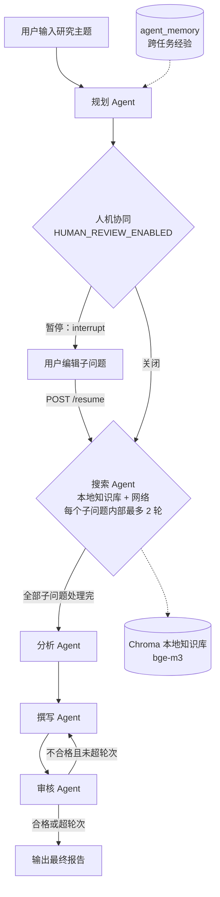

# AgentForge — 基于 LangGraph 的多 Agent 智能研究协作系统（v2.0）

> 用户输入一个研究主题，系统自动完成：任务分解 → 信息检索 → 交叉分析 → 报告撰写 → 质量审核，
> 最终输出结构化研究报告；支持真实本地知识库、跨任务经验记忆、人机协同（暂停/编辑/恢复）、
> 单进程 worker、任务指标与 SSE 事件流。

## 功能特性（已实现）

- **5 个专业 Agent**：规划 / 搜索 / 分析 / 撰写 / 审核，LangGraph 状态图 + 条件路由；
- **受控 ReAct 搜索**：单节点并行处理全部子问题；每个子问题内部最多 2 轮（不足则改写查询词）；网络搜索失败如实降级、禁止编造来源；
- **审核闭环**：结构化评分（1-10）+ 定向建议，不合格回写修订；达到评分线或最大轮次强制收口；
- **真实本地知识库**：`docs/kb/`（manifest 白名单 + sha256 校验）→ 分块 500/重叠 50 → bge-m3（本地 HTTP 服务）→ Chroma；检索评估 hit_rate@3 / MRR；
- **跨任务经验记忆**：任务完成后把主题/子问题/关键发现写入 `agent_memory`；相似任务在 planner 前检索并注入"参考背景"（**仅跨任务经验记忆，不是完整短期+长期记忆系统**）；
- **人机协同（interrupt/resume）**：`HUMAN_REVIEW_ENABLED=true` 时 planner 后暂停，用户可编辑子问题后 `POST /api/tasks/{id}/resume` 恢复；
- **单进程 worker**：FastAPI lifespan 内轮询 pending，原子 claim（UPDATE...RETURNING）、心跳、stale 恢复、attempts；`POST /api/tasks/{id}/cancel`（running 为 best-effort）；
- **任务指标**：节点耗时 / LLM 调用 / token / 搜索次数 / 估算成本；`GET /api/tasks/{id}/metrics`；前端「📊 指标」Tab；
- **SSE 事件流**：`GET /api/tasks/{id}/stream`（status/log/node/interrupt/done/error；**不做断线续传**，Streamlit 仍用轮询）；
- **MCP**：FastMCP 暴露 `web_search` / `local_search` / `calculate`（stdio，可被 Claude Desktop / Codex 接入）；
- **前端（Streamlit）**：发起研究 / 任务历史 / 知识库（语料+检索预览）/ 实验对比 / 系统信息；URL 深链接 `?page=kb` 等；
- **工程化**：pytest（98 项）、ruff、CI workflow、依赖锁定、单任务硬上限与成本闸门。

## 系统架构



## 技术栈

Python 3.12 · FastAPI · LangGraph（+ langgraph-checkpoint-sqlite） · LangChain · Ollama / Qwen2.5-7B（本地） · DeepSeek API（对比实验） · Tavily / DuckDuckGo · ChromaDB · bge-m3（本地 HTTP embedding 服务） · SQLite（任务库 + checkpoint） · Streamlit · FastMCP · pytest · ruff

## 快速开始

### 1. 环境准备

```bash
python -m venv venv
venv\Scripts\Activate.ps1        # Windows
pip install -r requirements-lock.txt
```

### 2. 本地模型与 embedding 服务

```powershell
# Ollama（模型目录按你的实际位置设置）
$env:OLLAMA_MODELS="D:\OllamaModels"; ollama serve
ollama pull qwen2.5:7b

# bge-m3 embedding 服务（复用本地权重，避免向主 venv 安装 torch/FlagEmbedding）
D:\ANACONDA\envs\pytorch_env\python.exe scripts\embed_server.py --port 11435
```

### 3. 构建知识库

```powershell
# docs/kb 下放入允许公开的 md/txt，并维护 manifest.json（sha256 白名单）
python scripts/build_kb.py --rebuild
python -m app.kb.eval_kb          # hit_rate@3 / MRR
```

### 4. 配置（.env）

```bash
LLM_PROVIDER=ollama               # ollama | deepseek | mock
OLLAMA_BASE_URL=http://127.0.0.1:11434/v1
OLLAMA_MODEL=qwen2.5:7b
EMBEDDING_BASE_URL=http://127.0.0.1:11435
MEMORY_ENABLED=true
HUMAN_REVIEW_ENABLED=false        # true 时创建任务会先暂停等待编辑子问题
WORKER_ENABLED=true
WEB_SEARCH_ENABLED=true           # false 时只走本地知识库（演示/离线）
ALLOW_PAID_PROVIDER=false         # 默认关闭付费 provider
TASK_SOFT_TIMEOUT_SECONDS=900
```

### 5. 启动

```powershell
uvicorn app.main:app --reload --port 8000   # API: /docs
streamlit run frontend/app.py               # UI: http://localhost:8501
```

### 6. 端到端（进程内，无端口，推荐用于验证）

```powershell
python scripts/e2e_review_flow_inprocess.py   # pending → paused → resume → completed
python scripts/measure_sse_latency.py         # SSE 首事件 p50（参考指标）
```

## API 概览

| 方法 | 路径 | 说明 |
|------|------|------|
| POST | `/api/tasks` | 提交研究任务（worker 异步领取） |
| GET | `/api/tasks` | 任务列表 |
| GET | `/api/tasks/{id}` | 任务详情（分析/报告/审核/日志/metrics） |
| POST | `/api/tasks/{id}/resume` | 恢复 paused 任务（提交编辑后的子问题） |
| POST | `/api/tasks/{id}/cancel` | 取消任务（pending/paused 直接取消；running best-effort） |
| GET | `/api/tasks/{id}/metrics` | 任务指标（节点耗时/token/搜索/成本） |
| GET | `/api/tasks/{id}/stream` | SSE：status/log/node/interrupt/done/error（不断线续传） |
| GET | `/api/tasks/{id}/report` | 获取最终报告 |
| GET | `/api/reports/{id}/download` | 下载报告 Markdown |
| GET | `/api/kb/stats`、`POST /api/kb/search` | 知识库统计 / 检索预览 |
| GET | `/api/experiments/live` | Ollama vs DeepSeek 真实运行记录 |
| GET | `/api/system/info` | 运行配置/上限/价格授权/MCP 工具 |
| GET | `/health` | 健康检查 |

## 项目结构

```
AgentForge/
├── app/
│   ├── main.py              # FastAPI 入口 + lifespan（迁移/恢复/worker）
│   ├── config.py            # 配置与单任务硬上限
│   ├── observability.py     # UsageTracker（线程安全：预留/记账/节点耗时）
│   ├── worker.py            # 单进程 worker（claim/心跳/stale/取消）
│   ├── migrations.py        # 轻量 SQLite 迁移
│   ├── agents/              # 5 个 Agent（含受控 ReAct 搜索）
│   ├── tools/               # 网络搜索（缓存/计数）/ 本地检索 / 安全计算器
│   ├── graph/               # LangGraph 状态图（含 human_review）
│   ├── kb/                  # loader（manifest 白名单）/ indexer / embedding / eval
│   ├── llm/                 # LLM 工厂（ollama/deepseek/mock）
│   ├── db/                  # SQLAlchemy 模型（含 metrics/locked_at 等）
│   ├── services/            # 任务服务、跨任务记忆
│   └── routes/              # tasks / reports / insights
├── docs/kb/                 # 知识库语料 + manifest.json
├── docs/upgrade/            # 各阶段证据（G0/G1/G2/G3、A1-A5、B1-B4、RISKS）
├── frontend/app.py          # Streamlit 多页面
├── scripts/                 # build_kb / embed_server / e2e / measure_sse_latency / MCP 验证
├── tests/                   # 98 项测试
├── Dockerfile / docker-compose.yml
└── requirements-lock.txt
```

## 真实运行记录

### 原始批量运行（5 主题）
用 `scripts/run_batch.py` 对 5 个主题各运行一次，数据记录于 `data/batch_results.json`：

| 主题 | 耗时(s) | 子问题 | 检索资料 | 审核轮次 | 评分 | 报告字符 |
|------|--------:|-------:|---------:|---------:|-----:|---------:|
| 2025年大语言模型发展趋势 | 79.41 | 5 | 40 | 1 | 8 | 5960 |
| 向量数据库技术选型对比 | 81.85 | 5 | 45 | 1 | 7 | 5851 |
| Python异步编程最佳实践 | 76.56 | 5 | 37 | 1 | 8 | 10380 |
| 多智能体系统架构设计 | 79.51 | 5 | 42 | 1 | 8 | 8193 |
| 检索增强生成RAG技术现状 | 93.07 | 5 | 43 | 1 | 8 | 7681 |

**汇总（5 次样本）**：完成率 5/5；平均耗时 82.08 秒；平均检索 41.4 条；审核均 1 轮通过，平均评分 7.8；平均报告 7613 字符。样本量小，引用时请注明「5 次实测」。

### Ollama vs DeepSeek（2026-09-10，真实运行）
记录见 `data/live_results.json`：Ollama 2 主题（49.8s / 90.9s，各 3 子问题）；DeepSeek 对比 2 主题（48.8s / 46.3s，各 5 子问题）。DeepSeek 阶段估算 ¥1.9945（占位价，授权已消费），合计估算 ¥2.5745。
> **边界**：两个 provider 的 planner 输出子问题数不同（3 vs 5），属**探索性对比**，不能据此声称模型优劣；价格表为占位价，未经官方核验。

## 能力边界（务必如实）
- 仅**本地演示**：无公网部署、无鉴权、无生产用户；
- **Docker**：`Dockerfile` / `docker-compose.yml` 文件就绪，但本机未安装 Docker，未本地构建验证；
- **微调**：未完成（P2-2 三连败与恢复见 `P2-2失败案例.md`，属历史 SmartKB 项目材料）；
- **YAML 配置 / 快速-标准-深度多工作流模板**：**规划中，未实现**，不得写入简历；
- **SSE**：仅后端接口，不做断线续传；前端使用轮询；
- **取消**：running 为 best-effort（安全点收敛）；
- **metrics**：resume 记录恢复执行段的指标；usage 缺失记 null（不按 0 计）。

## 设计说明（相对原始手册的改进）
1. 修复搜索循环索引 bug；2. 审核评分改结构化 JSON；3. 受控 ReAct 显式状态机；4. 计算器 AST 白名单；5. LLM 工厂 live/mock 双模式；6. 量化数据不预设；7. 单一线程安全预算守卫（原子预留 + 成本预检）；8. manifest 白名单 + sha256 语料校验；9. 轻量迁移（不引入 Alembic）；10. 进程内 E2E（TestClient，避免常驻端口）。
