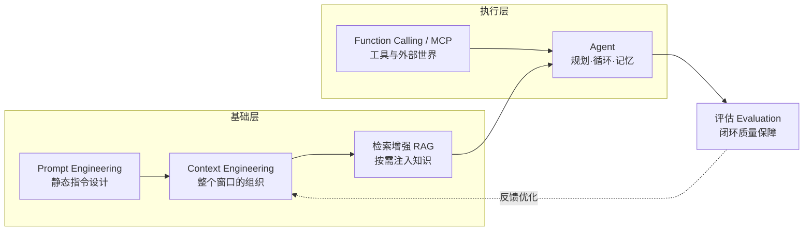

# 主流大模型与应用范式分析

> **面向 AI 应用开发实习面试的系统性学习资料（2026 年 8 月整理）**
> 本文基于 2026 年 8 月可公开检索的信息整理。大模型版本与价格变化极快，凡标注「待核实」之处，面试前请以各厂商官方文档为准。学习目标：**能说出是什么、能画出链路、能讲清取舍、能默写代码骨架、能回答边界问题**。

---

## 目录

1. 写在前面：三个心智模型
2. 一、主流大模型全景（9 家）
3. 二、应用范式深度解析（Prompt / Context / RAG / Agent / Tool+MCP / 其他）
4. 三、范式选型指南
5. 四、结语与推荐阅读
6. 五、参考来源

---

## 写在前面：三个心智模型

1. **模型是概率性的能力底座，应用工程是把"不确定性"变成"确定性产品"的过程。** 同一个模型，在不同的提示词、上下文组织、检索与工具编排下，产出质量可以天差地别——这正是应用工程师的价值所在。
2. **2026 年的主战场已经从"提示词"转移到"上下文组织 + 工具调用 + 长程执行"。** 上下文窗口普遍达到 1M，Agent 可以自主运行数小时，范式重心的迁移是面试高频考点。
3. **面试官真正想听到的是"结构化逻辑 + 工程权衡 + 边界意识"。** 背八股远不如讲清楚"为什么这样设计、代价是什么、什么时候它不 work"。

---

# 一、主流大模型全景

## 1.1 2026 年年中的行业格局（一页速览）

| 梯队 | 代表模型 | 一句话定位 |
|---|---|---|
| 闭源旗舰（智能天花板） | GPT-5.6 Sol、Claude Fable 5 / Opus 5、Gemini 3.1 Pro | 复杂推理、编码、Agent、专业工作 |
| 闭源高性价比主力 | GPT-5.6 Terra / Luna、Claude Sonnet 5、Gemini 3.6 Flash | 日常负载、规模化调用 |
| 开源第一梯队 | DeepSeek-V4、Qwen3.7-Max、Kimi K3、GLM-5.2、Llama 4 | 私有化部署、数据不出域、成本敏感 |
| 垂直/生态位 | Grok 4.5（编程+Agent）、Claude Haiku 4.5（低成本） | 特定场景性价比 |

**2026 年六大趋势（面试可引用）：**

1. **1M 上下文成为"标配"而非"卖点"**：GPT-5.6、Claude Fable 5/Opus 5、Gemini 3.x、DeepSeek-V4、Qwen3.7、Kimi K3、GLM-5.2 均支持约 1M token 上下文。
2. **推理强度（reasoning effort）成为独立旋钮**：同一模型可切换 thinking / medium / high / max / ultra，按任务难度花钱。
3. **Agentic 与长程任务是评测与产品焦点**：GPT-5.6 的 ultra 模式默认并行 4 个智能体；Qwen3.7 宣传"35 小时自治执行"；Claude Opus 5 主打"长时间运行的 Agent"。
4. **"每美元性能"叙事取代"单项跑分"叙事**：GPT-5.6 主打"更低成本达到同等效果"；Luna 降价 80%、Terra 降价 20%（2026-07-30）；DeepSeek 在 2026 年 8 月预告涨价，价格战进入下半场。
5. **开源与闭源差距缩小**：Kimi K3（2.8T 总参数）号称全球最大开源模型，多项评测逼近闭源旗舰；DeepSeek-V4 用约 27% 的单 token 推理 FLOPs 实现 1M 长上下文。
6. **多模态原生 + 工具调用 + 缓存优化成为默认能力**：Gemini 3.6 Flash 原生支持 5 种输入模态；GPT-5.6 引入显式缓存断点（explicit cache breakpoint）。

## 1.2 各家详述

### 1. OpenAI —— GPT-5.6 家族（Sol / Terra / Luna）

- **公司/团队**：OpenAI（与微软深度合作，Azure 托管）。
- **旗舰模型与定位**：2026 年 7 月 8-9 日全量上线 **GPT-5.6**，三个稳定能力层级（Sol/Terra/Luna 按各自节奏独立演进）：**Sol** 旗舰（编程、网络安全、科学、知识工作、计算机使用）；**Terra** 均衡（性能对标 GPT-5.5 但成本更低）；**Luna** 轻量（速度与成本优先）。推理强度分 medium/high/max，另设 **ultra**（默认并行 4 个智能体）。
- **核心技术特点**：测试时推理（test-time reasoning）、推理监控器（reasoning monitor）安全机制、多智能体并行、Responses API 中的**可编程工具调用**（在内存中编写并运行小程序来协调工具、过滤中间数据）、显式缓存断点（缓存至少 30 分钟有效）。
- **上下文与多模态**：约 1M token 上下文（官方文档标注 1.05M），最大输出 128K；输入支持文本+图像，输出为文本。
- **价格与性价比**（每百万 token，输入/输出）：Sol $5/$30；Terra $2.5/$15；Luna $1/$6（2026-07-30 起 Luna 降 80%、Terra 降 20%）。官方宣称 Sol 在 Artificial Analysis Intelligence Index 达约 58.9，编码智能体指数 80（SOTA）。
- **生态/API/工具链**：ChatGPT / ChatGPT Work / Codex / OpenAI API（Responses API、多智能体测试功能）；可编程工具调用支持"零数据保留"（ZDR）。

### 2. Anthropic —— Claude 家族（Fable 5 / Opus 5 / Sonnet 5 / Haiku 4.5 / Mythos 5）

- **公司/团队**：Anthropic（OpenAI 前核心成员创办，主打"安全优先"，Claude Code 与 **MCP 协议**的发起方）。
- **旗舰模型与定位**：**Claude Fable 5**（2026-06-09 正式可用，自适应推理，多项榜单第一）；**Claude Opus 5**（2026-07-24 发布，$5/$25 仅为 Fable 5 一半价格，主打复杂编码、长时间运行的 Agent、企业专业工作）；**Claude Sonnet 5**（2026-06-30，中端主力）；**Claude Haiku 4.5**（低成本快模型）；**Claude Mythos 5**（研究/预览形态，尚未正式开放，能力最强）。
- **核心技术特点**：安全与对齐研究领先、**自适应推理（adaptive reasoning / extended thinking）**、Agent 能力（Claude Code 读取整个代码库并迭代执行）。
- **上下文与多模态**：Fable 5 / Opus 5 均 1M 上下文、最大输出 128K；支持多模态输入（文本、图像、PDF 等）。
- **价格与性价比**：Fable 5 为 $10/$50（是 Opus 4.8 的 2 倍，曾因规则限制临时下架 3 天后恢复）；Opus 5 为 $5/$25；Sonnet 5 中端定价。
- **生态/API/工具链**：Claude API、Amazon Bedrock、Google Cloud、Microsoft Foundry；Claude Code（终端 Agent 编程工具）；**MCP（Model Context Protocol）生态核心推手**。

### 3. Google —— Gemini 3.x（3.1 Pro / 3.6 Flash / 3.5 Flash）

- **公司/团队**：Google DeepMind。
- **旗舰模型与定位**：**Gemini 3.1 Pro**（2026 年 2 月发布，深度推理旗舰，面向数学、科学、复杂分析）；**Gemini 3.6 Flash**（2026-07-21 发布，主力工作马，编码/知识工作/多模态，比 3.5 Flash 输出 token 节省 17%）；另有 **3.5 Flash、3.5 Flash-Lite、3.5 Flash Cyber** 等。
- **核心技术特点**：**原生多模态**（一个模型统一文本/图像/视频/音频/文件五种输入模态）、原生长上下文、与 Google 搜索/Workspace/Android 深度集成。
- **上下文与多模态**：约 1M token（1,048,576）；多模态输入输出；检索基准 GDM-MRCR v2 表现强。
- **价格与性价比**（每百万 token）：3.6 Flash $1.5/$7.5；3.1 Pro $2/$12。
- **生态/API/工具链**：Google AI Studio、Vertex AI、Gemini API（兼容 OpenAI 格式）；Workspace（Docs/Sheets/Gmail）与 Android 系统级集成；生态客户如 Hebbia、Harvey 用于文档解析与图表分析。

### 4. DeepSeek —— DeepSeek-V4（Pro / Flash）

- **公司/团队**：深度求索（DeepSeek，幻方量化背景），中国开源代表。
- **旗舰模型与定位**：2026-04-24 开源 **DeepSeek-V4** 双版本：**V4-Pro**（1.6T 总参数、49B 激活，定位"智力天花板"级推理）与 **V4-Flash**（284B 总参数、13B 激活，高性价比），原生思考模式，发布 58 页技术报告。
- **核心技术特点**：MoE 稀疏激活 + 混合注意力（**CSA 压缩稀疏注意力 + HCA 深度压缩注意力**，一说是 MLA 多头潜在注意力的延续/改造，细节各资料口径不一，**待核实**）；在 1M 上下文下 V4-Pro 单 token 推理 FLOPs 仅为 V3.2 的 27%、KV Cache 为 10%，大幅降低长上下文成本；前几层 MoE 使用哈希路由防止起始层路由塌缩。
- **上下文与多模态**：原生 1M 上下文；以文本/代码为主（多模态支持情况**待核实**）。
- **价格与性价比**（每百万 token，2026 年 8 月现行价）：V4-Flash 输入（缓存未命中）¥1/输出 ¥2，缓存命中输入仅 ¥0.02；V4-Pro 输入 ¥3/输出 ¥6，缓存命中输入 ¥0.025。2026 年 8 月官方预告将大幅涨价（低价策略回调）。
- **生态/API/工具链**：HuggingFace 开源权重（deepseek-ai/DeepSeek-V4-Pro 等）、华为昇腾率先适配；V4-Flash 是目前唯一支持 Responses API 并可接入 Codex 的 V4 模型（**以官方公告为准**）。

### 5. 阿里巴巴 —— Qwen3.7-Max / Qwen3.7-Plus

- **公司/团队**：阿里巴巴（通义千问团队，阿里云百炼平台）。
- **旗舰模型与定位**：2026-05-20 阿里云峰会发布 **Qwen3.7 系列**，旗舰 **Qwen3.7-Max** 定位"**全能智能体基座**"，在编程、推理、工具调用上跨越式升级，Arena 盲测位列国产模型第一（超过 Kimi-K2.6、DeepSeek-V4-Pro、GLM-5.1）；另有 **Qwen3.7-Plus** 商用主力。
- **核心技术特点**：面向 Agentic 时代设计，支持**35 小时超长程自治执行**；架构资料口径不一（一说 MoE 稀疏激活+原生多模态，一说 Max 为纯文本、全参数密集约 1.2T 参数，**待核实**，以百炼文档为准）。
- **上下文与多模态**：原生 1M 上下文；Max 单次最大输出 65536 tokens；多模态能力**待核实**（部分资料称 Max 无视觉、Plus 覆盖多模态）。
- **价格与性价比**：Max 输入约 ¥2.5/百万 token（输出价与其他档位**待核实**）；支持 Token Plan 订阅。
- **生态/API/工具链**：阿里云百炼（API + Token Plan）、Model Studio、通义 App/PC/网页端；兼容 OpenAI、Anthropic 等主流协议，便于迁移。

### 6. 月之暗面 —— Kimi K3

- **公司/团队**：月之暗面（Moonshot AI），Kimi 系列。
- **旗舰模型与定位**：2026 年 7 月中下旬正式开源 **Kimi K3**，**2.8T 总参数 MoE（激活约 104B），号称全球参数最大的开源模型**，面向长程编程、知识工作、复杂推理；AI Arena 前端代码竞技场登顶（1677 分），Artificial Analysis 综合智能 57 分，仅次于 Claude Fable 5 与 GPT-5.6 Sol。
- **核心技术特点**：大规模 MoE + 原生视觉理解；公开评测显示**编码/长程任务强，但可靠性（幻觉率）存争议**（某第三方实测称幻觉率较高，**该数据争议较大、待核实**）。
- **上下文与多模态**：1M token 上下文；原生视觉理解。
- **价格与性价比**：第三方对比中单任务成本约 $2.31（对比 Qwen3.7-Max $1.54、Grok 4.5 high $1.36、GLM-5.2 max $0.9，**口径待核实**）；官方 API 定价请查官方文档。
- **生态/API/工具链**：开源权重 + 技术报告 + Infra 技术同步开放；阿里、华为等厂商 Day0 适配。

### 7. 智谱 —— GLM-5.2

- **公司/团队**：智谱 AI（清华大学技术背景，港股上市，公司代码 02513）。
- **旗舰模型与定位**：2026 年 6 月发布 **GLM-5.2**，面向**长程任务（Long Horizon Task）**设计，主打"减少复杂任务中的上下文漂移与目标遗忘"，支持真正可用的 1M 上下文（400K-500K 区间指令遵循稳定）。
- **核心技术特点**：MoE 稀疏混合专家 + 动态稀疏注意力；总参数 744B、激活约 40B；训练数据截止 2025 年 11 月；**MIT 协议全面开源**（2026-06 起）；纯文本+代码模态，**不含多模态**。
- **上下文与多模态**：1M 无损上下文；纯文本/代码。
- **价格与性价比**：约 $0.9/百万 token（max 档，**口径待核实**），主打性价比与长程成本控制。
- **生态/API/工具链**：GLM Coding Plan（Lite/Pro/Max/团队版）、智谱开放平台 BigModel、阿里云 Model Studio 等渠道提供。

### 8. xAI —— Grok 4.5

- **公司/团队**：xAI（马斯克创立，与 X/Twitter 生态、特斯拉算力绑定）。
- **旗舰模型与定位**：2026 年 7 月发布 **Grok 4.5**，1.5T 参数 MoE（V9 基础架构），**与 Cursor 代码编辑器联合训练**，主打编程、Agent 与知识工作；SWE-Bench 上成绩领先（约 64.7%，榜单口径不同，**待核实**）。
- **核心技术特点**：大参数 MoE、推理速度快（约 80 TPS）、Token 成本降至前代约 1/4；支持视觉输入。
- **上下文与多模态**：500K 上下文（可配置，官方预告升级至 1M）；视觉输入、文本输出。
- **价格与性价比**：约 $2/$6 每百万 token（输入/输出）。
- **生态/API/工具链**：xAI API、与 X 平台集成；Grok 在 Cursor 等第三方工具生态中广泛接入。

### 9. Meta —— Llama 4（Maverick / Scout）

- **公司/团队**：Meta（FAIR），开源权重生态的奠基者。
- **旗舰模型与定位**：**Llama 4** 是 Meta 首个 MoE 架构开源系列：**Maverick**（400B+ 总参、17B 激活，复杂推理/代码/多语言，128K 上下文）、**Scout**（109B 总参、1M 上下文，长文档与 RAG 场景；发布时曾宣传 10M 上下文，**以官方文档为准**）。
- **核心技术特点**：MoE + 视觉原生（vision-native），一个模型同时理解文本与图像。
- **上下文与多模态**：Maverick 128K；Scout 1M（10M 宣传口径待核实）；多模态原生。
- **价格与性价比**：完全开源权重（HuggingFace 可下载），自托管成本 = 硬件成本（如单卡 H100 月租 $800-1200）；无官方 API 标价。
- **生态/API/工具链**：vLLM、Ollama、llama.cpp 等推理栈全面支持；适合数据不出域、私有化、定制微调。

## 1.3 主流模型对比总表（2026 年 8 月整理）

| 模型 | 公司 | 旗舰型号 | 定位 | 上下文 | 多模态 | 成本/性价比（每百万 token） | 特色 |
|---|---|---|---|---|---|---|---|
| GPT-5.6 | OpenAI | Sol（旗舰）/ Terra / Luna | 通用旗舰·推理·编码·Agent | ~1M（1.05M），输出 128K | 文本+图像输入，文本输出 | Sol $5/$30；Terra $2.5/$15；Luna $1/$6（已降价） | 推理强度旋钮（max/ultra）、多智能体并行、可编程工具调用 |
| Claude | Anthropic | Fable 5 / Opus 5 | 推理·编码·长程 Agent·企业 | 1M，输出 128K | 文本/图像/PDF 输入 | Fable 5 $10/$50；Opus 5 $5/$25 | 安全对齐、自适应推理、Claude Code、MCP 发起方 |
| Gemini | Google | 3.1 Pro（推理旗舰）/ 3.6 Flash（主力） | 深度推理 / 高性价比多模态 | 1M | **原生多模态 5 种输入** | 3.6 Flash $1.5/$7.5；3.1 Pro $2/$12 | 与搜索/Workspace/Android 集成，多模态最强生态 |
| DeepSeek-V4 | 深度求索 | V4-Pro / V4-Flash | 开源推理旗舰 / 高性价比 | 原生 1M | 以文本/代码为主（待核实） | Pro ¥3/¥6；Flash ¥1/¥2（缓存命中输入 ¥0.02） | CSA+HCA 混合注意力、长上下文极致省算力、开源 |
| Qwen3.7 | 阿里 | Qwen3.7-Max | 全能智能体基座 | 1M，输出 64K | 待核实（一说纯文本） | Max 输入约 ¥2.5 | 35 小时自治执行、百炼平台、兼容主流协议 |
| Kimi K3 | 月之暗面 | K3 | 长程编程·知识工作·推理 | 1M | 原生视觉 | 待核实（第三方单任务成本约 $2.31） | 全球最大开源模型（2.8T MoE）、编码榜第一；可靠性存争议 |
| GLM-5.2 | 智谱 | GLM-5.2 | 长程任务·编码 | 1M | 纯文本/代码 | 约 $0.9（max，待核实） | MIT 开源、动态稀疏注意力、目标遗忘优化 |
| Grok 4.5 | xAI | Grok 4.5 | 编程·Agent·知识工作 | 500K（可配置） | 视觉输入 | 约 $2/$6 | 与 Cursor 联合训练、推理速度快、成本低 |
| Llama 4 | Meta | Maverick / Scout | 开源通用 / 长文档 RAG | Maverick 128K；Scout 1M（宣传 10M） | 视觉原生 | 开源自托管（无 API 标价） | 开源生态霸主、私有化首选 |

## 1.4 面试速答（模型全景）

1. **"2026 年主流大模型有哪些？"** 一句话：闭源三强 OpenAI GPT-5.6（Sol/Terra/Luna）、Anthropic Claude（Fable 5/Opus 5/Sonnet 5）、Google Gemini 3.x（3.1 Pro/3.6 Flash）；开源五虎 DeepSeek-V4、阿里 Qwen3.7、月之暗面 Kimi K3、智谱 GLM-5.2、Meta Llama 4；外加 xAI Grok 4.5。关键词：**1M 上下文、推理强度可调、Agentic、每美元性能**。
2. **"怎么给业务选模型？"** 答：看四个维度——任务类型（推理/编码/长文本/多模态/Agent）、数据合规（能否出域→开源私有化 or 闭源）、预算（每百万 token 成本 + 缓存折扣）、生态（框架/协议兼容性）。先跑通最小闭环，再按评测数据换模型。
3. **"开源和闭源怎么选？"** 闭源省心、能力通常领先、按量付费；开源可控（数据不出域、可微调、可自托管）、长期成本可预测，但需要运维与硬件。安全敏感行业（金融/政务）倾向开源私有化。
4. **"为什么 2026 年上下文都做到 1M 了？"** 硬件（HBM 带宽）与算法（稀疏注意力、KV Cache 压缩如 MLA/CSA/HCA）共同进步，让"放得下"变便宜；但"放得下≠用得好"，引出上下文工程与 RAG。
5. **"最新价格战你怎么看？"** 模型方用"每美元性能"抢市场（Luna 降 80%）；DeepSeek 涨价说明低价不可持续，成本优化（缓存、模型路由）仍是应用层必修课。

---

# 二、应用范式深度解析（重点）

## 2.0 范式关系总览



一句话理解：**Prompt Engineering 是"把指令写好"，Context Engineering 是"把放进窗口的所有信息组织好"，RAG 是"告诉模型该看哪份资料"，Agent 是"让模型自己决定下一步做什么并调用工具"，评估是"证明这套系统真的可用"。** 它们不是互斥的，而是层层叠加的关系。

---

## 2.1 Prompt Engineering（提示词工程）

### 定义/核心思想
通过**精心设计输入给模型的指令文本**，引导模型输出符合预期的结果。它是与模型交互最基础、成本最低、迭代最快的杠杆。核心假设：模型已具备能力，提示词负责"激活与约束"。

### 典型实现方式
- **指令设计（Instruction）**：明确任务、约束、输出格式、角色与受众，避免歧义。例：`你是一位资深客服主管，请用不超过 50 字、礼貌专业的语气回复……`
- **Few-shot（少样本）**：在提示中给出 2-5 个输入-输出示例，让模型"照样子做"。示例要覆盖边界情况与错误纠正。
- **CoT（Chain-of-Thought，思维链）**：要求模型"先推理再回答"（`请一步步思考`），或用 Few-shot CoT 示例示范推理过程；显著提升数学/逻辑类任务准确率，但会增加 token 消耗。现代模型多数内置了隐藏推理（thinking），对外仍可要求"展示推理摘要"。
- **角色设定（Role Prompting）**：设定身份、语气、专业领域，稳定输出风格。
- **结构化输出（Structured Output）**：要求输出 JSON/XML/Markdown，配合 `response_format`（如 OpenAI `json_schema` 强制模式）或 `strict` 参数，保证下游可解析。
- **模板化与版本管理**：把提示词沉淀为模板（变量插值），用提示词版本号 + 评测集做回归，避免"玄学改词"。

```text
# 模板示例（客服意图分类）
system: 你是客服工单分类器。只输出 JSON：{"category": "售后|物流|退款|其他", "confidence": 0-1}
user:   工单内容：{ticket_text}
```

### 优缺点
- 优点：零成本、快速迭代、不依赖训练数据、可解释性好。
- 缺点：**不可靠**（同样的提示在不同模型/温度下输出不稳定）；**脆弱**（措辞微调结果大变）；**不能注入新知识**（知识截止时间外的事实无能为力）；**易受注入攻击**（用户输入可劫持指令）；复杂任务能力有天花板（提示词无法让模型"学会"它不会的技能）。

### 适用场景
意图分类、格式化抽取、文本改写/润色、简单问答、低风险自动化、原型验证。

### 工程要点
1. 提示词也"面向测试"：每个线上模板配套 20-50 条 golden set 做回归。
2. 输出结构优先于自由文本；能选枚举就不要开放生成。
3. 对用户输入做**指令隔离**（分隔符 + 明确"以下为不可信数据"），防注入。
4. 温度/采样参数纳入版本管理（温度 0 用于抽取，0.7+ 用于创意）。

### 面试常问与参考回答要点
- **Q：Few-shot 示例放几个最好？** 答：2-5 个够用；关键在于示例覆盖边界与反例（"这不算退货"），而不是数量。
- **Q：CoT 一定更好吗？** 答：逻辑/数学类任务显著提升；但增加 token 成本与延迟，简单任务反而可能过度思考，需要按任务分级开关。
- **Q：提示词工程最大的坑？** 答：把业务稳定性押在不可靠的文本上——生产系统必须配结构化输出、校验与兜底（重试/规则/人工）。
- **Q：怎么防提示注入？** 答：输入输出双向过滤 + 指令/数据分隔 + 权限最小化 + 对敏感操作加人工确认；**提示词本身无法根除注入，工程防护才是答案**。

### 本节面试速答（可背诵）
1. PE 的本质是"用文本激活模型已有能力并约束输出"，杠杆最低、见效最快、但不可靠。
2. 四大技巧：指令清晰化、Few-shot（含反例）、CoT（先推理后回答）、结构化输出（JSON Schema + strict）。
3. 生产三件套：模板 + 版本管理 + 评测回归；输出永远走结构化+校验。
4. 局限必须主动承认：不能补新知识、易注入、不稳定——所以需要 Context Engineering 与 RAG 补位。

---

## 2.2 Context Engineering（上下文工程）

### 定义/核心思想
**Context Engineering 是把"整个上下文窗口"当作一个可设计、可优化的系统来组织**：不仅要写好指令，还要管理注入的资料、对话历史、工具结果、系统边界与记忆，使模型在窗口内"看到"的信息最大化有用、最小化噪音。它与 Prompt Engineering 的区别：**PE 优化"指令这段文字"，CE 优化"窗口里所有信息的结构、顺序、取舍与生命周期"**。

### 与 Prompt Engineering 的关键区别（面试必答）

| 维度 | Prompt Engineering | Context Engineering |
|---|---|---|
| 对象 | 指令文本本身 | 整个上下文窗口（指令+资料+历史+工具结果） |
| 问题 | "怎么让模型听懂要求" | "让模型看到什么、不看什么、按什么顺序看" |
| 手段 | 措辞、示例、角色、格式 | 压缩、裁剪、排序、边界、记忆、状态管理 |
| 重心 | 静态 | 动态、随对话与任务演化 |
| 2026 年地位 | 基础能力 | **更重要的杠杆**（见下） |

### 为什么 2026 年 Context Engineering 比 Prompt Engineering 更重要？
1. **窗口变大、成本变低**：1M 上下文 + 缓存降价，让"把资料都塞进去"成为可行选项，随之而来的是"塞什么、怎么塞"的问题——这正是 CE 的主场。
2. **模型对位置敏感（lost in the middle）**：长窗口里模型对中间位置的记忆显著弱于头尾，排序（relevant-first / 结构清晰）成为质量分水岭。
3. **长程 Agent 成为常态**：Agent 运行数小时产生海量中间状态与工具结果，如何压缩、归档、摘要，直接决定任务能否不"跑偏"（GLM-5.2 的卖点就是"减少上下文漂移与目标遗忘"）。
4. **成本优化**：上下文是成本大头，CE 的压缩/裁剪直接换算成账单（DeepSeek 缓存命中输入仅 ¥0.02/M，说明"命中缓存"本身是 CE 的一部分）。

### 典型实现方式
- **上下文压缩**：对话历史摘要（如"每 10 轮把前文压成 3 句摘要"）、关键信息抽取、丢弃无关工具输出。
- **上下文裁剪/滑动窗口**：只保留最近 N 轮 + 全局摘要；或按相关度打分只保留 Top-K。
- **排序**：重要信息放开头（指令、任务目标）与结尾（关键约束、即时数据），中间放参考资料；避免"丢在中间"。
- **边界控制**：用 system/user/tool 角色严格分隔指令与数据；显式声明"以下内容来自检索，可能过时，请以事实为准"；设置上下文断点（如 GPT-5.6 的显式缓存断点）控制缓存命中范围。
- **记忆与状态管理**：分层记忆——工作记忆（当前轮窗口）、情景记忆（对话摘要/事件）、语义记忆（长期知识，落库检索）；状态外置（任务进度、变量存到外部存储，不塞进窗口）。
- **长期记忆**：跨会话记忆 = 抽取要点写回记忆库（向量/键值/文档），下轮按需召回注入，配合 RAG 同一套检索设施。

### 与 RAG 的关系
**RAG 是 Context Engineering 的"获取阶段"**：CE 决定"窗口里该有什么"，RAG 负责"从哪里、如何拿到该有的内容"。长上下文解决**容量**问题（放得下），RAG 解决**质量**问题（放的是相关且最新的）；两者互补而非替代。面试标准答案：**1M 上下文不取消 RAG，因为容量 ≠ 相关性，也不解决"知识要实时更新、要可溯源"的问题。**

### 优缺点
- 优点：直接作用于质量与成本、与模型解耦（换模型不换架构）、可观测可测试。
- 缺点：实现复杂（压缩算法、记忆策略要自己维护）、压缩本身有信息损失、需要专门评测长程稳定性。

### 适用场景
长对话客服、Agent 长程任务、多文档问答、流式会话、成本敏感的大上下文调用。

### 工程要点
1. 先量化：记录每轮 token 构成（指令/资料/历史/工具），压缩要"按占比花钱"。
2. 摘要要"可回退"：压缩后保留摘要 + 原文链接，关键事实回查原文。
3. 位置敏感是实锤：重要信息放头尾，用"needle-in-haystack / MRCR"类基准回归。
4. 记忆分层落地：短期窗口 + 中期摘要 + 长期检索库，三层各司其职。

### 面试常问与参考回答要点
- **Q：Context Engineering 和 Prompt Engineering 什么区别？** 见上表，一句话：静态指令 vs 整个窗口的组织。
- **Q：长对话上下文溢出怎么办？** 答：三层方案——滑动窗口+摘要压缩（丢了细节）、关键信息抽取外置（结构化存库）、必要时 RAG 按需召回；工程上再加 token 预算监控与预警。
- **Q：1M 上下文都有了，还要 RAG 吗？** 答：要。容量不等于相关性；RAG 提供实时性、可溯源、低成本（1M 全塞的成本远高于检索 Top-K）；两者组合是 2026 年主流。
- **Q：怎么评估上下文工程做得好不好？** 答：长上下文检索基准（MRCR/GraphWalks 类）+ 目标任务的端到端评测 + 成本（token 用量）三合一。

### 本节面试速答（可背诵）
1. CE 定义：把整个窗口当作可设计系统——管"放什么、怎么排、何时丢"。
2. 与 PE 的区别一句话：**PE 管指令文字，CE 管窗口全局**。
3. 四大手段：压缩（摘要）、裁剪（滑动窗口）、排序（头尾优先，防 lost-in-the-middle）、边界（角色隔离+断点）。
4. 记忆分层：工作记忆/情景记忆/语义记忆 + 长期记忆库；状态外置不塞窗口。
5. 与 RAG：**RAG 是 CE 的获取阶段；长上下文解决容量，RAG 解决相关性与实时性**。

---

## 2.3 RAG（检索增强生成，Retrieval-Augmented Generation）

### 定义/核心思想
RAG 在生成前**先从外部知识库检索与问题相关的片段**，注入上下文后让模型基于这些片段作答，从而把"模型记忆"扩展为"模型 + 外部知识库"。核心思想：**知识不进参数，进上下文；答案可溯源、可更新**。

### 典型实现方式（离线建库 + 在线问答）
```text
离线建库：
  文档采集 → 解析/清洗（PDF/Word/HTML）→ 分块 Chunk → 嵌入 Embedding
  → 写向量库（faiss/pgvector/Milvus/Qdrant）+ 倒排索引（BM25）

在线问答：
  query → 查询改写/意图识别 → 混合检索（向量召回 + BM25 召回）
  → 融合（RRF/加权）→ 重排 Rerank → 拼装上下文（带引用编号）
  → LLM 生成（要求只依据上下文并标注来源）
```
- **混合检索**：向量检索擅长语义相似，BM25 擅长精确词匹配（产品型号、人名、编号）；两者融合后 RRF（Reciprocal Rank Fusion）合并，再上重排模型（cross-encoder reranker）精排。
- **分块策略（Chunking）**：按语义/标题层级/固定窗口分块，块间重叠 10-20%；块大小影响召回粒度（问答用小块，摘要用大块）；2026 年趋势：结构化文档按层级切分 + 父子块（检索小块、喂大块）。
- **HyDE（Hypothetical Document Embeddings）**：先用 LLM 把 query 扩写成"假设答案"，再用假设答案去检索，缓解查询与文档表达不一致的问题。
- **查询改写（Query Rewrite）**：多轮对话先做指代消解与扩展（"它"→"上文的显卡"）。
- **评估**：检索侧（召回率 Recall@k、命中率、MRR）+ 生成侧（忠实度 faithfulness、答案准确率、引用正确率）+ 端到端人工抽检。

### 优缺点
- 优点：知识可实时更新（改库即生效）、答案可溯源（给引用）、可控（可以拒绝回答库外内容）、成本低于微调、可解释。
- 缺点：**不能完全消除幻觉**（检索不到、检索到错误片段、模型仍会编造/过度自信）；依赖检索质量（召回差则生成差）；链路复杂、延迟与成本增加；知识冲突时模型行为难预测。

### RAG 的边界（面试高频）
1. 检索是上限：库中没有 → 再好的模型也答不出（要设计"不知道就明说"）。
2. 检索到不相关/冲突片段 → 模型可能被误导。
3. 模型自身的编造倾向不会因为 RAG 消失，只是被约束。
4. 需要强逻辑推理/领域推理能力时，RAG 只解决"知识"不解决"能力"。

### 适用场景
客服问答、企业知识库、法律/医疗/金融文档问答、私有数据问答、需要引用与审计的合规场景。

### 工程要点
1. 质量基线：先人工标注 100-300 条 Q&A，量化"检索召回率"与"生成正确率"两个指标再上线。
2. 链路可观测：记录每问的召回 top-k、rerank 分数、引用，方便排查。
3. 分块要随文档结构走：先做版面解析（标题层级/表格/段落），再切块。
4. 别一上来就上 RAG：如果问题都能被 1M 上下文直接覆盖且文档量小，直接塞全文更简单。
5. 兜底设计：低置信度（无引用/检索分低）→ 转人工或明确"知识库未覆盖"。

### 面试常问与参考回答要点
- **Q：RAG 为什么用 BM25 + 向量混合检索？** 答：两者互补——BM25 精词匹配（型号/人名/编号），向量语义匹配（换说法）；单一召回会漏；融合后再重排保证 Top 精度。
- **Q：Chunk 怎么切？** 答：先按文档结构（标题/段落/表格）切，再设块大小与重叠；问答场景偏小（256-512 token），摘要/长文场景偏大；可配合父子块（检索小块、生成喂大块）。
- **Q：RAG 能消除幻觉吗？** 答：不能。RAG 是"约束"而非"消除"；幻觉还来自检索错误、知识冲突、模型固有编造倾向；治理 = 检索质量 + 提示约束 + 引用 + 兜底 + 评估。
- **Q：RAG 和长上下文什么关系？** 答：容量 vs 相关性；1M 上下文不取代 RAG，但"文档少、全塞更便宜"时可以直接长上下文，二者按规模与实时性取舍。

### 本节面试速答（可背诵）
1. RAG 一句话：**生成前先检索，知识不进参数进上下文**；离线建库 + 在线问答两条链路。
2. 经典链路：Chunk → Embedding → 向量库 → 混合检索（向量+BM25）→ RRF 融合 → Rerank → 拼上下文 → 生成（带引用）。
3. 三个关键优化：分块策略、查询改写/HyDE、重排；两个指标：召回率（检索侧）与忠实度（生成侧）。
4. 边界必答：**RAG 不能完全消除幻觉**，只做约束；1M 上下文不取代 RAG（容量≠相关性）。

---

## 2.4 Agent（智能体）

### 定义/核心思想
Agent = **模型（大脑）+ 规划（Plan）+ 工具（Act）+ 记忆（Memory）+ 执行循环**。它不再"一问一答"，而是把任务拆解、自主决定步骤、调用工具、观察结果、迭代直至完成。核心思想：**把"一次生成"升级为"一个可收敛的工作循环"**。

### 单 Agent：ReAct 与 Plan-and-Execute
**ReAct（Reasoning + Acting）**——交替思考与行动：

```python
# ReAct 循环（伪代码）
history = [user_query]
for step in range(max_steps):            # 防死循环：硬上限
    thought = llm(history)               # 1. 思考：现在该做什么
    if thought.contains_tool_call:
        action, args = parse(thought)    # 2. 解析动作，如 search("API 文档")
        observation = execute(action)    # 3. 执行工具，拿到结果
        history += [thought, observation]
    else:
        return llm(history)              # 4. 无需工具，直接作答
raise TimeoutError("达到最大步数，给出部分结果并转人工")
```

**Plan-and-Execute**：先让模型产出完整计划（Plan），再逐条执行（Execute），中途可修正。适合步骤清晰、可预见的任务；相比 ReAct 减少"边想边做"的 token 开销，但对环境变化不敏感。

### 多 Agent 协作编排模式（面试必答）
| 模式 | 思想 | 典型场景 |
|---|---|---|
| 路由（Router） | 一个"调度器"把请求分给不同专家 Agent | 客服分流：退款/技术/物流 |
| 并行（Fan-out/Fan-in） | 把任务拆成并行子任务，最后汇总 | 同时调研 5 个来源再写报告 |
| 编排者-工作者（Orchestrator-Worker） | 主 Agent 拆解+派发+验收，Worker 执行 | 大型代码重构、研究报告 |
| 审核循环（Reviewer/Guard） | 生成者 + 审核者迭代，通过才放行 | 代码评审、内容安全、合规输出 |
| 竞速/投票（可选补充） | 多个模型同跑取优/投票 | 高价值决策、低容错任务 |

### 状态共享、记忆、防死循环
- **状态共享**：多 Agent 之间共享任务清单（task queue）、共享存储（文件/数据库/消息总线），而不是靠对话传递全部状态；用结构化"工作台账"外置进度。
- **记忆**：复用 2.2 的分层记忆；Agent 的长程任务尤其依赖"目标清单 + 已完成/进行中 + 关键决策记录"的显式状态，防止目标遗忘（GLM-5.2 的卖点正是这个）。
- **防死循环**：最大步数/最大 token/超时熔断；重复检测（同一 tool+args 出现 N 次即终止）；"走投无路"分支（明确告诉模型可以放弃并请求帮助）；预算用完转人工。
- **成本与延迟控制**：小模型做路由/分类、大模型做核心推理；工具结果截断（GPT-5.6 可编程工具调用的思想：过滤中间数据只回传关键信息）；缓存；并行度上限。

### 框架与产品形态
- **LangChain**：早期生态最全的组件库（链、记忆、工具、回调），适合快速原型；缺点是抽象层多、调试难。
- **LangGraph**：把 Agent 建模为**状态图**（节点=步骤，边=条件跳转），显式控制循环与分支，适合生产级可控 Agent。
- **OpenAI Agents SDK / Responses API 多智能体**：官方支持子智能体（subagent）并行与汇总。
- **Codex / Claude Code**：**产品形态的 Agent**——读取整个代码库、规划修改、执行命令、跑测试迭代；代表"编码 Agent"这一 2026 年最热落地方向。
- **自制最小实现**：ReAct 循环 + 工具注册表 + 状态文件 + 日志，往往比框架更可控（面试可强调"先徒手实现一遍，再上框架"）。

### 优缺点
- 优点：处理多步骤、多工具、长程任务；把 LLM 从"聊天"变成"干活"；可组合出复杂工作流。
- 缺点：**不可靠放大**（一步错步步错）、成本与延迟高、死循环与失控风险、状态一致性难保证、可观测性要求高。

### 适用场景
代码生成与重构、数据分析、自动化办公（写邮件/做表/排日程）、复杂调研、客服工单全流程处理、DevOps 运维。

### 工程要点
1. 先写"收敛条件"：任务完成标准、超时标准、放弃标准，缺一不可。
2. 工具结果要截断+结构化，防止"被工具结果淹没"（上下文污染）。
3. 全程可观测：每一步的 thought/action/observation 落日志，出问题可回放。
4. 分级授权：只读工具默认开放，写/删/发消息等敏感操作要人工确认或加权限层。
5. 从"单 Agent + 简单工具"起步，复杂了再拆多 Agent——多 Agent 的通信与一致性问题比收益更常见。

### 面试常问与参考回答要点
- **Q：ReAct 和 Plan-and-Execute 区别？** ReAct 边想边做、灵活但 token 多；P&E 先计划后执行、省 token 但应变差；长任务常用 P&E + 中途再计划。
- **Q：多 Agent 怎么防止互相干扰？** 答：共享状态用外置台账而非对话；每个 Agent 职责边界清晰；任务队列 + 锁；审核节点收敛输出。
- **Q：Agent 死循环怎么治？** 答：硬上限（步数/token/时间）+ 重复检测 + 放弃分支 + 转人工；这是面试加分项。
- **Q：LangChain 和 LangGraph 怎么选？** LangChain 快速原型组件全；LangGraph 图式状态机、显式控制循环、适合生产；小团队可徒手 ReAct + 工具注册表。
- **Q：Agent 和 RAG 什么关系？** RAG 是 Agent 的一个"工具/记忆来源"；Agent 可以调用检索工具按需取知识，二者是包含而非并列。

### 本节面试速答（可背诵）
1. Agent = 模型 + 规划 + 工具 + 记忆 + 循环；核心是"可收敛的工作循环"。
2. ReAct 四步：思考 → 解析动作 → 执行工具 → 观察结果，循环到答案或达上限。
3. 多 Agent 四种编排：路由、并行、编排者-工作者、审核循环。
4. 防死循环三件套：最大步数/超时、重复检测、放弃分支（转人工）。
5. 框架一句话：LangChain 原型、LangGraph 状态图生产；Codex / Claude Code 是编码 Agent 的产品形态。

---

## 2.5 Tool / Function Calling 与 MCP

### Function Calling 原理
Function Calling 让模型**输出"调用哪个函数、传什么参数"的结构化指令**，由应用层执行并把结果回填给模型。本质是：**把模型的"表达能力"接入"外部世界"**（数据库、API、计算器、搜索）。

```python
# OpenAI 风格 Function Calling
tools = [{
  "type": "function",
  "function": {
    "name": "get_weather",
    "description": "查询指定城市当前天气",
    "parameters": {
      "type": "object",
      "properties": {"city": {"type": "string"}},
      "required": ["city"]
    }
  }
}]
# 模型返回: tool_calls=[{"id":"call_1",
#   "function":{"name":"get_weather","arguments":"{\"city\":\"上海\"}"}}]
# 应用层执行 get_weather("上海")，把结果以 role="tool" 消息回填
# 模型基于工具结果生成最终回答
```
关键点：工具描述（含参数 JSON Schema）写得越清晰，模型选对工具的成功率越高；`strict` 模式可强制参数符合 Schema；工具结果本身也占用上下文（要截断）。

### 从 Function Calling 到 MCP：为什么需要标准化？
- **痛点**：每家模型厂商的 FC 格式略有不同，每个工具都要为每个框架各写一遍适配——形成 N×M 的"适配地狱"；工具无法复用、无法远程共享。
- **MCP（Model Context Protocol）**：由 Anthropic 提出并开放（2024 年底开源），2025-2026 年被 OpenAI、Google、阿里、微软等广泛采纳，成为**事实上的工具/上下文互操作标准**。MCP 采用 **JSON-RPC 2.0**，定义了三种角色：**Host（宿主/客户端，如 Claude Desktop、Codex）、Server（暴露工具/资源/提示词的进程）、Client（Host 内与 Server 通信的适配层）**。
- **为什么标准化**：工具一次开发、处处可用（跨模型、跨 IDE、跨桌面应用）；模型厂商与工具方解耦；生态共建（官方工具库、社区 Server）；安全与权限模型可集中治理。

```jsonc
// MCP 工具发现与调用（JSON-RPC）
// 1) 初始化握手
{ "jsonrpc": "2.0", "id": 0, "method": "initialize", "params": {...} }
// 2) 发现工具：返回工具名 + JSON Schema 参数描述
{ "jsonrpc": "2.0", "id": 1, "method": "tools/list", "params": {} }
// 3) 调用工具
{ "jsonrpc": "2.0", "id": 2, "method": "tools/call",
  "params": { "name": "get_weather", "arguments": { "city": "上海" } } }
// 4) 返回：content 数组（文本/图片等）+ isError 标志，供模型自纠正
```

### Skill 生态
2026 年 MCP 之上衍生出 **Skill（技能包）** 概念（如 Claude Skills / Codex Skills）：把"提示词 + 工具 + 流程"打包成可复用单元，Agent 按需加载。生态位：**Tool 解决"能做什么"，Skill 解决"怎么做得专业"**。

### 工具调用安全（必答）
MCP 官方安全规范（2026 年修订）明确：
- **Server 必须（MUST）**：校验所有工具输入、实现访问控制、限流、净化工具输出。
- **Client 应该（SHOULD）**：敏感操作前征求用户确认、调用前向用户展示工具输入，防止恶意/意外数据外泄。
- **应用层工程**：最小权限（工具只授予所需权限）、沙箱（代码执行放容器/受限环境）、审计日志（谁在何时调了什么工具）、参数校验（防注入：把用户内容当数据不当指令）。

### 优缺点
- 优点：能力边界无限扩展（模型本身不强，工具补强）；结果可控可审计；FC/MCP 是 Agent 的地基。
- 缺点：工具越多选择错误率越高（要精简+描述好）；工具结果占用上下文、增加成本；安全面扩大（工具即攻击面）。

### 适用场景
搜索/天气/计算器、查数据库/调用业务 API、写文件/执行代码、发邮件/排日程（办公自动化）、与旧系统对接。

### 面试常问与参考回答要点
- **Q：Function Calling 原理？** 模型在训练/指令下输出结构化 tool_calls，应用层执行后以 tool 消息回填，模型再生成最终回答；描述（含 Schema）决定选工具成功率。
- **Q：MCP 和 Function Calling 什么关系？** FC 是"模型输出工具调用的能力"；MCP 是"工具如何被发现、声明、调用、传输"的标准化协议；MCP 之上的 FC 跨模型复用。
- **Q：为什么需要 MCP？** 消灭 N×M 适配、工具一次开发处处可用、生态与安全模型集中治理；一句话：**标准化协议解决互操作与复用**。
- **Q：工具调用安全怎么保证？** 最小权限 + 输入校验 + 沙箱执行 + 敏感操作人工确认 + 审计；Server 侧 MUST 校验/限流/净化。
- **Q：工具太多模型选错怎么办？** 精简工具集、优化名称与描述（语义清晰）、按场景分组/路由、加"不确定就不调用"的提示、评测选工具准确率。

### 本节面试速答（可背诵）
1. FC 三步：模型输出 tool_calls → 应用执行 → 结果以 tool 消息回填；JSON Schema 声明参数。
2. MCP = 工具层的事实标准（JSON-RPC 2.0）：initialize → tools/list → tools/call；Host/Server/Client 三角色。
3. 为什么标准化：**N×M 适配地狱 → 一次开发处处可用**；跨模型、跨应用、生态共建。
4. 安全口诀：**最小权限、输入校验、沙箱执行、用户确认、审计日志**；Server MUST 校验/限流/净化。

---

## 2.6 其他范式简析

### 1) Fine-tuning（微调）：何时微调 vs 用上下文/RAG
| 诉求 | 首选方案 |
|---|---|
| 注入私有/最新知识 | RAG（不改模型、可更新、可溯源） |
| 固定输出风格/格式（如特定 JSON、公文语气） | 少量微调（或提示词先行） |
| 固化领域行为（客服话术、审核规则） | 微调 |
| 需要长程能力/特定工具熟练度 | 微调 + 工具/Agent |
| 想让模型"更听话"、降延迟（用小模型替代大模型） | 微调小模型（蒸馏/对齐） |
- **口诀**：知识用 RAG，行为用微调；先提示词、再 RAG、后微调——微调是"最后手段"里最贵的一种。微调的风险：灾难性遗忘、数据质量放大、评测过拟合、更新迭代成本高。

### 2) 多模态应用
- 输入侧：文档解析（扫描件/图表/表格）、截图理解、音视频摘要、多模态检索（图文互检）。
- 输出侧：文生图/图生图、语音合成（TTS）、图表的自然语言解读。
- 工程要点：选原生多模态模型（Gemini 3.x、GPT-5.6、Kimi K3）；图像要压缩/裁剪到模型要求；多模态输出用独立模型管线（LLM 规划 → 图像模型生成 → 校验）。

### 3) Embedding 与向量数据库
- Embedding：把文本/图像映射为稠密向量，语义相近则距离近；2026 年趋势是**多模态 embedding 与长文本 embedding**（1M 文档直接整篇嵌入）。
- 向量数据库：faiss（轻量）、pgvector（Postgres 插件，业务库一体）、Milvus/Qdrant/Weaviate（专用、分布式）；2026 年很多场景被"SQL 向量检索 + 混合索引"替代，**别盲目上专用向量库**。
- 工程要点：embedding 模型要与检索数据同语种/同领域匹配；评估用召回率而非"看着像"。

### 4) 评估（Evaluation / LLM-as-a-judge）
- 三层评估：检索指标（Recall@k、MRR）、生成指标（忠实度、准确率、引用正确率）、业务指标（转化率、好评率）。
- **LLM-as-a-judge**：用强模型给输出打分/对比，需防"位置偏差、自我偏好、冗长偏好"；加评分 rubric、多次抽样、人工抽检校准。
- 2026 年趋势：Agent 评测（任务完成率、步数成本）、长上下文评测（MRCR/GraphWalks）、评估集持续沉淀为公司资产。
- 面试点：**没有评估就没有工程**——所有范式优化都要以评测分数回填为准。

### 5) Streaming（流式）
- 用途：首 token 延迟（TTFT）感知、长输出渐进展示、用户体验。
- 工程要点：SSE/WebSocket；流式输出与结构化输出冲突时（如 JSON 流）可用"增量解析/缓冲到闭合再解析"；推理模型（thinking）先流思考再流回答，产品上要区分展示。

### 6) 缓存与成本优化
- **Prompt 缓存**：公共前缀命中缓存（OpenAI/DeepSeek/Anthropic 均有）；GPT-5.6 的显式缓存断点可控制缓存边界；DeepSeek 缓存命中输入仅 ¥0.02/M——**把稳定前缀（系统提示+知识库）放在前面是纯省钱**。
- **模型路由**：简单任务走小模型（Luna/Haiku/Flash），难任务走旗舰；先分类后生成。
- 其他：批量推理、输出 token 上限控制、上下文压缩、重试与退避。

### 本节面试速答（可背诵）
1. 微调 vs RAG：**知识用 RAG，行为用微调**；顺序是提示词 → RAG → 微调。
2. 评估三层：检索指标 + 生成指标 + 业务指标；LLM-as-a-judge 要防偏差、配 rubric、人工抽检。
3. 成本三板斧：Prompt 缓存（前缀稳定化）、模型路由（大小模型分层）、输出控制（上限+压缩）。
4. Streaming 关键：TTFT 优先、SSE、结构化流式输出要缓冲解析。
5. Embedding/向量库别迷信：小数据 pgvector 够用，专用库留给大规模检索。

---

# 三、范式选型指南

## 3.1 决策流程（伪代码）

```text
function 选型(需求):
    # 第 1 步：需求拆解——这是"知识/行为/执行"哪类问题？
    if 问题是"知道某答案" 且 知识来自私有/实时/更新频繁资料:
        goto RAG 路线
    if 问题是"按固定格式产出" 或 "特定领域行为":
        goto 提示词 → 必要时微调
    if 问题是"多步骤、要用外部系统、要自主决策":
        goto Agent + 工具/MCP 路线

    # 第 2 步：最小方案优先
    方案 = Prompt Engineering（指令+结构化输出+防注入）
    若 文档量大或需实时知识 → 叠加 RAG（混合检索+重排+引用）
    若 需要访问业务系统/执行动作 → 叠加 Function Calling/MCP
    若 需要自主规划多步 → 升级为 Agent（ReAct 或 P&E，配状态与防死循环）
    若 输出质量仍不达标 → 微调（最后手段）

    # 第 3 步：横切检查
    评估（建 golden set 回归）、成本（缓存/路由）、安全（权限/沙箱/人工确认）、可观测（日志/引用）
```

## 3.2 四大业务场景的推荐组合

| 场景 | 推荐范式组合 | 关键设计 |
|---|---|---|
| 客服问答 | **RAG + 工具调用 + 人工兜底** | 知识库混合检索；查订单/售后调业务 API；无引用/低置信度转人工；对话摘要控制上下文 |
| 代码生成 | **Agent（编码）+ 工具调用 + 沙箱 + 评估** | 读代码库→规划→改文件→跑测试→迭代；沙箱执行；测试通过才算完成（Codex/Claude Code 形态） |
| 数据分析 | **Agent + 工具调用（SQL/Python）+ 多模态图表 + 校验** | 大模型写 SQL/代码→执行器跑→结果回流→生成图表与结论；对数字做二次校验；权限最小化 |
| 自动化办公 | **Agent + MCP 连接器 + 审核循环 + 权限控制** | 日历/邮件/文档走 MCP Server；写/发等敏感操作人工确认；Reviewer 审核产出后再放行 |

## 3.3 选型心法（面试可背）
1. **从最小可用的范式开始，而不是从最炫的范式开始**：能 Prompt 解决就别上 RAG，能 RAG 解决就别上 Agent。
2. **范式可叠加**：RAG 是 Agent 的工具/记忆来源，FC/MCP 是 Agent 的手脚，评估是全程的尺子。
3. **先定评估再定方案**：没有 golden set，任何范式优化都是"感觉变好了"。
4. **成本与安全是隐形约束**：缓存命中、模型路由、最小权限、人工确认，缺一项都可能上线后翻车。
5. **一句话总结**：**知识→RAG，行为→微调，执行→Agent+工具，质量→评估兜底，省钱→缓存+路由。**

---

# 四、结语与推荐阅读

**结语**：2026 年的 AI 应用开发，已经从"调提示词"进化到"设计系统"——把大模型当作一个"可编程的概率内核"，用上下文工程组织信息、用 RAG 注入知识、用工具调用接入世界、用 Agent 编排执行、用评估闭环保障质量。对实习生而言，**能把 ReAct 循环默写出来、能把 RAG 链路画出来、能把"为什么需要 MCP"讲清楚、能诚实说出各范式的边界**，就已经远超平均水平。

**推荐阅读/资料（面试前重点补）**：
1. **官方文档**：OpenAI Responses API 与 GPT-5.6 模型页、Anthropic Claude 文档（含 MCP）、Google Gemini 模型卡与 DeepMind 博客、DeepSeek-V4 技术报告、阿里云百炼 Qwen 文档、智谱开放平台文档。
2. **关键论文/报告**：ReAct（Yao et al., 2022）、Retrieval-Augmented Generation for Knowledge-Intensive NLP Tasks（Lewis et al., 2020）、Lost in the Middle（Liu et al., 2023）、HyDE（Gao et al., 2022）、LLM-as-a-judge（Zheng et al., 2023）、DeepSeek-V3/V4 技术报告、MCP 规范文档。
3. **实践资料**：LangGraph 官方教程、MCP 快速开始、向量数据库（pgvector/Milvus）官方文档、各厂"最佳实践"博客（OpenAI / Anthropic / Google / 阿里云）。
4. **社区**：Hugging Face、Artificial Analysis / BenchLM 等模型榜单与定价页。

---

# 五、参考来源（2026-08-10 检索）

1. OpenAI 官方：GPT-5.6 发布页 https://openai.com/zh-Hans-CN/index/gpt-5-6/
2. OpenAI 开发者文档：GPT-5.6 Terra 模型页 https://developers.openai.com/api/docs/models/gpt-5.6-terra
3. BenchLM：Best Anthropic Models（2026-08） https://benchlm.ai/best/anthropic-models
4. 网络资讯杂志：Anthropic 发布 Claude Opus 5 https://netmag.tw/2026/07/28/anthropic-claude-opus-5
5. OpenRouter：Claude Fable 5 API 与定价 https://openrouter.ai/anthropic/claude-fable-5
6. InfoQ：Claude Fable 5 发布三天遭临时下架 https://www.infoq.cn/article/UXghld6fuzYxJNuU6L47
7. Google DeepMind：Gemini 3.6 Flash 模型卡 https://deepmind.google/models/model-cards/gemini-3-6-flash/
8. Google 官方博客：Introducing Gemini 3.6 Flash 等 https://blog.google/innovation-and-ai/models-and-research/gemini-models/gemini-3-6-flash-3-5-flash-lite-3-5-flash-cyber/
9. ai-indeed：Gemini 3.6 Flash 与 3.1 Pro 对比 https://www.ai-indeed.com/encyclopedia/27908.html
10. DeepSeek-V4 发布报道（官方启动页收录） https://deepseekv4.app/zh/news/2026-04-24-deepseek-v4-official-launch-report
11. CAICT AI Hub：DeepSeek-V4-Flash 模型卡 https://aihub.caict.ac.cn/models/deepseek-ai/DeepSeek-V4-Flash
12. 中国证券网：DeepSeek 预告涨价与现行价格 https://www.cnstock.com/commonDetail/755926
13. 腾讯新闻：读懂 DeepSeek-V4（长上下文与稀疏注意力解读） https://news.qq.com/rain/a/20260428A06RC700
14. 中国日报：阿里发布 Qwen3.7-Max https://cn.chinadaily.com.cn/a/202605/20/WS6a0d97a2a310942cc49ad59b.html
15. 阿里云开发者：Qwen3.7-Max 百炼介绍 https://developer.aliyun.com/article/1736097
16. 阿里云开发者：Qwen 3.7 Plus 与 Max 实测对比 https://developer.aliyun.com/article/1741462
17. 证券时报：Kimi K3 正式开源 https://stcn.com/article/detail/4044661.html
18. CNMO：Kimi K3 开源（2.8T 参数） https://ai.cnmo.com/news/814322.html
19. 今日头条评测：Kimi K3 真实体验（幻觉率争议） https://m.toutiao.com/article/7663385340396405254/
20. i黑马：智谱发布 GLM-5.2 https://www.iheima.com/article-398536.html
21. 智谱 AI 开放文档：新品发布 https://docs.bigmodel.cn/cn/update/new-releases
22. 北京智源 BAAI：Grok 4.5 发布解读 https://hub.baai.ac.cn/view/56232
23. LLM-Stats：Grok 4.5 定价与上下文 https://llm-stats.com/models/grok-4.5
24. CrazyRouter：Llama 4 Maverick API 指南 https://crazyrouter.com/en/blog/llama-4-maverick-api-complete-guide-zh-2026
25. MCP 官方规范：Tools（含安全要求） https://modelcontextprotocol.io/specification/draft/server/tools
26. Safeguard：MCP 权限模型解析 https://safeguard.sh/resources/blog/model-context-protocol-permissions-model
27. 卡码笔记：2026 年 Agent/大模型面试题汇总（ReAct/FC/MCP/RAG） https://notes.kamacoder.com/interview/llm/agent_interview.html
28. 腾讯云开发者：RAG/Agent 高频面试题 https://cloud.tencent.com.cn/developer/article/2702835
29. CSDN：为什么有了 1M 长上下文还需要 RAG https://blog.csdn.net/weixin_42001184/article/details/161256692

---

*文档撰写时间：2026-08-10。模型版本、价格与基准数据随时间快速变化，面试与选型前请以官方最新文档为准；文中「待核实」条目已逐条标注。*